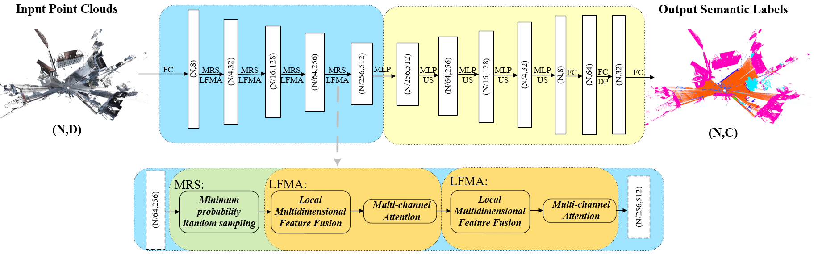

### About Me
I am a Ph.D. Student at Southern University of Science and Technology & Pengcheng Laboratory, advised by Prof. Hong Zhang and Prof. Jinqiang Cui,  since 9/2024.

### Research

My research interests focus on robotics, with a particular emphasis on the following areas:
1. Robot Perception.
2. Place Recognition. 

