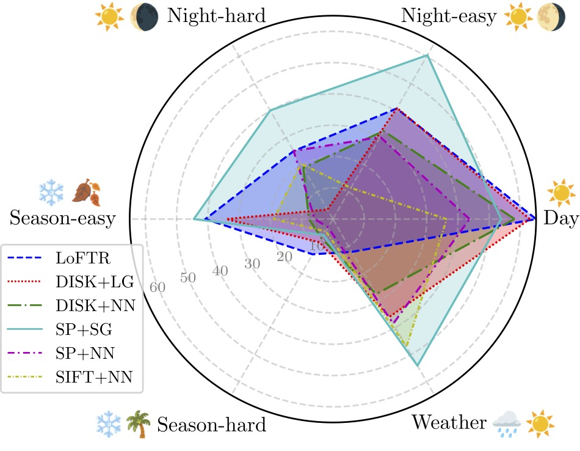
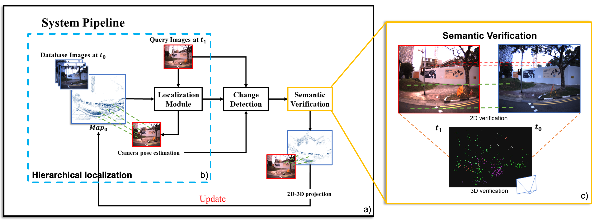
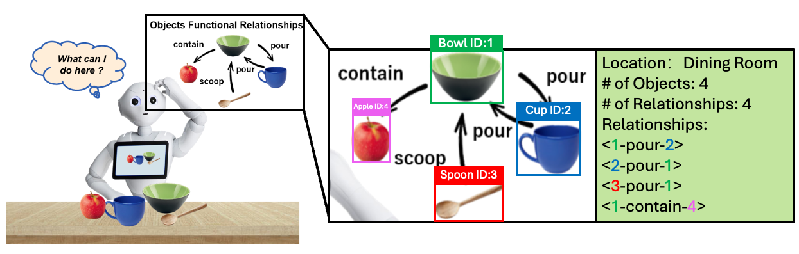

### About Me
Hi there, I am Jingwen YU (中文名：于靖文), a Ph.D. candidate at [Cheng Kar-Shun Robotics Institute (CKSRI)](https://ri.hkust.edu.hk/), Hong Kong University of Science and Technology (HKUST) and affiliated with [Shenzhen Key Laboratory of Robotics and Computer Vision Lab](https://rcvlab.eee.sustech.edu.cn/) at Southern University of Science and Technology (SUSTech). I am co-supervised by [Prof. Ping TAN](https://ece.hkust.edu.hk/pingtan) and [Chair Prof. Hong ZHANG (SUSTech)](https://eee.sustech.edu.cn/?view=%E5%BC%A0%E5%AE%8F&jsid=18&lang=en). I work closely with [Dr. Jianhao JIAO](https://gogojjh.github.io/), [Dr. Hengli WANG](https://hlwang1124.github.io/), [Mr. Hanjing YE](https://medlartea.github.io/), and [Mr. Chao TANG](https://mkt1412.github.io/). I was with the Intelligent Autonomous Driving Center (IADC) and [RAM-Lab](https://ram-lab.com/), led by Prof. [Ming LIU](https://facultyprofiles.hkust-gz.edu.cn/faculty-personal-page/LIU-Ming/eelium), where I got the chance to work on autonomous vehicles and quadruped robots. Besides, I am also interested in task-oriented grasping, check out my [personal website](https://jingwenyust.github.io/) for more details.

### Research
Currently, my research interests focus on long-term visual localization in dynamic and changing indoor environments. Specifically, I am focusing on developing a long-term visual localization system. In the meantime, I work with a quadruped robot and a low-speed autonomous vehicle.

1. Visual Loop Closure Detection and Verification (视觉回环检测和验证)

   

2. Visual Map Update with Semantics Assisted Verification for Accurate Localization (语义辅助验证的视觉地图更新以实现准确定位)

3. Building High Precision Dataset for SLAM Across Diverse Platforms and Scalable Environments (采集高精度SLAM数据集)

4. UGV-Quadrupedal Robot Autonomous Delivery (无人车-四足机器人自动送货)

5. Relationship Oriented Semantic Scene Understanding for Daily Manipulation Tasks (面向日常操作任务的由交互关系导向的场景语义理解）

